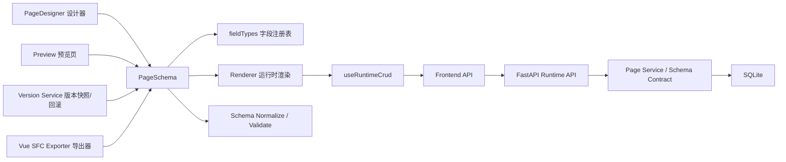

# LowCode Admin Builder 面试讲解稿

## 1 分钟项目介绍

这是一个基于 `PageSchema` 驱动的后台 CRUD 低代码页面构建器。用户可以在设计器里通过拖拽和属性编辑，配置搜索表单、表格列、弹窗表单、统计卡片和图表；同一份 schema 会同时驱动设计器预览、运行时页面、版本快照和 Vue SFC 导出。

我主要负责的是前端编辑器和运行时一致性这一层，包括 schema 规范化、拖拽编排、属性面板、草稿/发布双态预览、导出链路和质量门禁。这个项目的重点不是“做一个很花的画布”，而是把一个中后台低代码场景做得稳定、可维护、可讲清楚。

## 简历写法

- 基于 `Schema` 驱动实现低代码 CRUD 页面构建器，同一协议统一驱动设计器、运行时、版本回滚与 Vue 代码导出。
- 实现搜索区 / 表格区 / 表单区拖拽编排、属性面板即时编辑、撤销重做与本地草稿预览，提升编辑器可用性。
- 设计草稿 / 发布双态和版本回滚机制，解决编辑态与运行态数据校验不一致问题。
- 通过字段注册表、显式 schema 迁移、能力矩阵约束与前后端测试，保证渲染链路和导出结果一致。

## 项目亮点

### 亮点 1：Schema 真正贯穿全链路

不是只拿 schema 渲染表单，而是同一份协议同时服务于：

- 设计器拖拽与属性编辑
- 运行时 CRUD 页面
- 草稿 / 发布预览
- 版本保存与回滚
- Vue 单文件组件导出

这让项目的工程味道更强，也更像中大厂会认可的“协议驱动”项目。

### 亮点 2：编辑器与运行时的一致性做得比较完整

我重点修了几个很容易在面试里被追问的真实问题：

- 拖到哪个区域，就只出现在哪个区域，避免字段默认同时出现在搜索、表格、表单
- 本地未保存草稿也能直接预览，而不是强依赖服务端草稿
- 预览时读 draft，写操作也会带 `mode=draft`，避免草稿读写校验错位
- REST 外部数据源按只读能力矩阵收口，前端不会再展示假的写入口

### 亮点 3：复杂度控制得住

我没有把它做成自由画布、组件市场、多表关联那种难以讲清的方向，而是聚焦在后台 CRUD 低代码这个窄而深的场景。这样项目既有亮点，也适合实习面试在有限时间内讲明白。

## 架构图

## 前端分层怎么讲

### `schema/`

这里是协议层，负责默认 schema、字段注册表、字段规范化、prop 去重、schema 校验和迁移。我的理解是：低代码项目最重要的不是组件，而是协议。

### `views/`

这里主要是页面编排层：

- `PageDesigner.vue` 负责设计器
- `Preview.vue` 负责运行态预览
- `Main.vue` 负责项目和页面切换、顶部工具栏

我尽量保持 `views` 轻，只做页面级编排，不把太多业务逻辑堆进去。

### `composables/`

这里放可复用状态和行为：

- `usePageSchema` 负责 schema 加载、替换、导出 plain snapshot
- `useRuntimeCrud` 负责列表、表单、分页、提交、删除、请求态
- `useSchemaModels` 负责 searchModel / dialogForm 跟随 schema 同步
- `useSchemaHistory` 负责撤销重做

### `renderer/` 和 `utils/`

- `renderer/` 负责把字段和图表真正渲染出来
- `utils/` 放纯逻辑，比如图表聚合、导出器、能力矩阵、编辑辅助函数

这样做的好处是模块职责比较清楚，后续扩字段类型或者改导出逻辑时，影响面可控。

## 我做的关键难点

### 难点 1：拖拽设计怎么避免“看起来能拖，结果状态是乱的”

我把字段设计成“单字段 + 多区域可见性”的模型，核心不是在 DOM 上移动，而是改 schema 上的 `searchable / tableVisible / formVisible`。拖入哪个区，就只打开对应可见性，点击组件库新增也遵循当前选区。

这样做的收益是：

- 数据模型简单
- 渲染器好复用
- 导出器天然能复用同一协议

### 难点 2：预览为什么容易出问题

低代码项目里“设计器看到的”和“预览页实际跑的”很容易不一致。原来这个项目就有一个典型问题：预览会重新拉服务端草稿，所以本地未保存修改根本看不到。

我后面做了两层处理：

- 本地预览时直接传当前 schema snapshot
- 请求链路显式带 `draft / published mode`

这样预览就不再只是“看个样子”，而是跟真实运行规则一致。

### 难点 3：属性面板为什么是面试高频点

属性面板本质上是 schema 编辑器。真正难的不是放几个输入框，而是要解决：

- 字段 `prop` 唯一性
- 字段类型切换后的兼容归一化
- option/defaultValue 等联动
- 修改后 searchModel / dialogForm 如何同步

我这版补了 `prop` 自动规范化、冲突自动去重、即时反馈和统一变更入口，让属性编辑和运行模型不会脱节。

### 难点 4：为什么我会专门做导出校验

很多低代码项目的“导出 Vue 代码”只是下载一个字符串，不能说明工程质量。我这里让导出的 SFC 和运行时共享同样的字段规则、只读能力限制，并且在测试里用 Vue SFC 编译器做了解析/编译检查。

这在面试里会很加分，因为它说明我关注的不只是“功能有了”，而是“产物能不能可信落地”。

## STAR 表述

### STAR 1：修复设计器预览与运行时不一致

`S`
项目原本支持草稿预览，但预览页会重新拉服务端草稿，导致本地未保存修改无法预览；同时预览读 draft，写操作却按 published schema 校验。

`T`
我的目标是让预览真正成为“当前编辑结果的运行态验证”，而不是一个和设计器脱节的页面。

`A`
我做了三件事：

- 增加本地 schema snapshot 预览机制
- 统一前端运行时请求携带 `mode`
- 后端写接口按 `draft / published` 分别校验

`R`
最后设计器、预览页、后端校验链路统一了，本地未保存草稿可直接预览，也避免了草稿字段新增后写操作报错的问题。

### STAR 2：把拖拽和属性编辑收口成稳定的 schema 编辑链路

`S`
项目里拖拽新增字段和点击组件库新增字段的行为不一致，还存在字段默认同时出现在多个区域的问题。

`T`
我希望把新增字段、切换字段类型、编辑属性、模型同步这些动作统一成可维护的 schema 编辑流程。

`A`
我把字段模型收口成单字段多区域可见性，并补了：

- drop 目标区控制
- 当前选区新增
- `prop` 规范化与唯一化
- 统一 dirty 状态与历史快照
- 撤销重做和快捷键

`R`
编辑器行为更可预测，状态同步问题显著减少，也形成了一个面试里很容易展开讲的“编辑器状态设计”案例。

## 高频面试问答

### 1. 为什么你要用 Schema 驱动，而不是直接拖组件树？

因为这个项目目标是中后台 CRUD，而不是自由画布。Schema 驱动更适合表达字段、校验、搜索区、表格区、表单区这些结构化信息，也更容易复用到运行时、导出器和版本系统。

### 2. 拖拽设计里最容易踩的坑是什么？

不是拖拽库本身，而是拖拽后的状态模型。如果只是移动 DOM，很快会出现渲染和真实配置不一致。我这里把拖拽动作直接落到 schema，可见性和排序都由协议驱动。

### 3. 你为什么要做 schema 迁移？

低代码协议一旦上线就会积累历史数据。如果 schema 版本升级只改版本号，不写迁移函数，旧草稿和旧版本回滚都会埋雷。即使当前迁移逻辑不复杂，也要把链路立住。

### 4. 为什么要区分 draft 和 published？

因为编辑中的 schema 和线上运行的 schema 不是一个概念。草稿态强调快速试错，发布态强调稳定运行。把二者混在一起，很容易导致预览、保存、发布和线上页面相互干扰。

### 5. 这个项目里你最看重的工程点是什么？

我最看重的是一致性：同一份 schema 驱动设计器、运行时、导出器和版本系统；同一套能力矩阵约束预览和导出；同一条校验链路贯穿 draft 和 published。

### 6. 如果继续做，你下一步会做什么？

我会优先补真实浏览器 E2E 流程和更强的导出工程校验，比如把导出的 SFC 放进一个最小 Vite 工程做一次真实构建，这样发布可信度会更高。

## 面试时 30 秒亮点总结

如果面试官时间很紧，我会这样收尾：

“这个项目我不是单纯做了一个拖拽页面，而是把低代码后台最核心的协议层做完整了。核心是用 PageSchema 统一驱动设计器、运行时、版本系统和代码导出；我重点解决了拖拽区域归属、草稿/发布一致性、本地草稿预览、属性面板规范化和导出可信度这些真实工程问题。它的亮点不是功能堆得多，而是链路闭环比较完整，而且复杂度是可控的。” 

## 面试时不要这样讲

- 不要说“这是一个类似宜搭 / 钉钉搭建平台的完整低代码平台”，范围太大，容易被追着问垮
- 不要强调“无 bug”，更稳妥的是“当前无已知阻断缺陷”
- 不要把重点放在 UI 漂亮不漂亮，重点是 schema、渲染器、拖拽、预览、属性面板和质量门禁
- 不要把所有技术点都讲成“我都会”，重点讲 2 到 3 个你真正动手解决过的问题

## 推荐讲述顺序

1. 先用一句话讲项目定位
2. 再讲为什么用 Schema 驱动
3. 再讲你亲自解决的 2 到 3 个关键问题
4. 最后讲质量保障和后续可扩展性

---

这份稿子适合用于：

- 简历项目描述
- 面试自我介绍后的项目展开
- 面试官追问“你这个项目的技术亮点是什么”
- 模拟面试前背诵提纲
